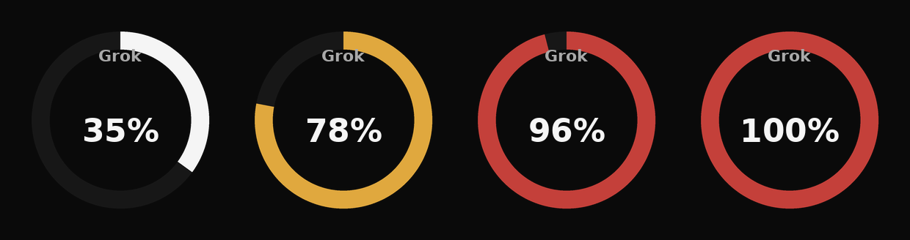

# Grok Usage — StreamController Plugin

A [StreamController](https://github.com/StreamController/StreamController) plugin that shows your **Grok Build** CLI subscription usage on a Stream Deck key: a progress ring for how much of your current billing period's credits you've used, plus the time left until it resets.

It works by tailing the Grok Build CLI's own local log (`~/.grok/logs/unified.jsonl`) for the `creditUsagePercent` value the CLI itself fetches and uses — no API key, no login, no network calls, and no cost per refresh, exactly like the sibling [Claude Code Usage](https://github.com/ENjxzlt/Claude-Code-Usage-Streamcontroller) plugin reads Claude Code's local session logs via `ccusage`. Optionally, it can also show the last completed turn's token count or approximate cost, read from your most recently active session's log.



> **Disclaimer:** This plugin — code, README, and assets — was written by [Claude Code](https://claude.com/claude-code), Anthropic's AI coding agent, based on prompts from the repo owner, following the log format a user shared in [this issue](https://github.com/ENjxzlt/Claude-Code-Usage-Streamcontroller/issues/6). **That log format is unofficial** — reverse-engineered from a real (redacted) log sample, not documented anywhere by xAI — so field names or the log's structure may change in a future Grok Build release and break this plugin. It hasn't been tested against a real Grok Build install yet; review it yourself before trusting it, and please open an issue (ideally with a redacted log sample) if a field has moved. Issues and PRs are welcome.

## What it shows

- **Progress ring:** a circular gauge drawn around the key, filling clockwise as you use up your current billing period's credits, in xAI's own monochrome brand style — near-white under 70%, amber 70–90%, red ≥ 90% (the amber/red aren't from xAI's brand kit, which is deliberately black-and-white only; they're hand-picked for legibility).
- **Top label:** `Grok`
- **Center label:** the **`creditUsagePercent`** value Grok Build itself last fetched — the same number the CLI/SuperGrok quota UI uses, not an estimate.
- **Bottom label:** your choice of:
  - time remaining in the current billing period (default), or
  - the last completed turn's **approximate cost** in USD, or
  - the last completed turn's **token count**
- If the log file has no recent billing entry, the key shows a neutral "No recent billing data" state instead of erroring
- Pressing the key forces an immediate refresh

> **Note on accuracy:** the percentage comes straight from Grok Build's own billing check, so it should match what the CLI shows you. The optional last-turn cost figure is a guess, though: `costUsdTicks`' unit isn't documented, so this assumes 1,000,000,000 ticks = $1 (inferred from the sample value in the originating issue) — treat it as approximate.

## Requirements

- StreamController (Flatpak or native install both work)
- [Grok Build](https://x.ai/) run at least once on the same machine, so `~/.grok/logs/unified.jsonl` exists and has a `billing: fetched credits config` entry in it
- No API key, no network access, and no `node`/`npm` needed — this only reads files Grok Build already writes locally

## Installation

### From the StreamController Store

Search for **Grok Usage** in StreamController's built-in store and install it from there.

### Manually

1. Clone or copy this folder somewhere on your machine.
2. Run the installer, which symlinks it into StreamController's plugin directory:
   ```bash
   ./install.sh
   ```
   This detects both the Flatpak install (`~/.var/app/com.core447.StreamController/data/plugins/`) and a native install (`~/.local/share/StreamController/plugins/`). If your setup differs, symlink the folder into your plugins directory manually.
3. Restart StreamController.
4. Open a key's action picker, find **Grok Usage**, and add it to a key.

## Configuration

Click the key's action in StreamController to open its settings:

| Setting | Default | Description |
| --- | --- | --- |
| Grok Build log file | `~/.grok/logs/unified.jsonl` | Where the CLI writes its unified log. Change this if yours lives somewhere else. |
| Grok Build sessions directory | `~/.grok/sessions` | Only read when the bottom label is set to show cost or tokens — used to find your most recently active session's log. |
| Bottom label | Time left in billing period | Swap to the last turn's approximate cost or token count instead. |
| Refresh interval | `60` seconds | How often the key updates in the background (minimum 15s). Free/local, so feel free to lower it. |

## How it works

Every refresh interval (and once immediately on key press), a background thread runs (via `flatpak-spawn --host` under Flatpak, plain `bash -lc` natively — the same pattern the Claude Code Usage plugin uses for `ccusage`):

```bash
tail -c 262144 ~/.grok/logs/unified.jsonl
```

and scans that chunk, newest line first, for the most recent line with `"msg": "billing: fetched credits config"`, pulling `ctx.config.creditUsagePercent` and `ctx.config.currentPeriod.end` (falling back to `ctx.config.billingPeriodEnd`) out of it. 256 KiB comfortably covers the last several CLI invocations without ever reading a log that's been growing for months in full.

If the bottom label is set to cost or tokens, it additionally runs:

```bash
find ~/.grok/sessions -type f -name updates.jsonl -printf '%T@ %p\n' | sort -rn | head -n1 | cut -d' ' -f2-
```

to find the most recently modified session, tails the last 64 KiB of *that* file, and scans it for the latest `params.update.sessionUpdate == "turn_completed"` entry's `usage` object. This lookup is best-effort: any failure here just falls back to the time-left display instead of erroring the whole key.

The ring is drawn with Pillow (already a StreamController dependency) at 4x resolution and downsampled for smooth edges, then set as the key's media. The UI update is marshalled back onto the main thread via `GLib.idle_add`, so a slow read never blocks StreamController.

## Troubleshooting

Check the log for errors, filtering to just this plugin:

```bash
# Flatpak
grep -E "GrokUsage" ~/.var/app/com.core447.StreamController/data/logs/logs.log
# native
grep -E "GrokUsage" ~/.local/share/StreamController/logs/logs.log
```

- **Key shows "No recent billing data":** Grok Build hasn't logged a billing check recently enough to still be within the last 256 KiB of the log file — run `grok` again, or increase the tail window by editing `LOG_TAIL_BYTES` in `actions/GrokUsage/GrokUsage.py` if your log file is unusually large.
- **Key shows "!" / "log read error":** the `[GrokUsage] ...` line right above it in the log has the actual failure — usually the log file doesn't exist yet at the configured path. Test by hand: `tail -c 1000 ~/.grok/logs/unified.jsonl`.
- **`Portal call failed: Failed to start command` (Flatpak):** make sure `flatpak-spawn` is available and StreamController's Flatpak has permission to talk to the host (this is the same mechanism, and same fix, as the Claude Code Usage plugin already needed).
- **Cost figure looks off:** it's an inferred unit conversion (see [Note on accuracy](#what-it-shows)) — please open an issue with a redacted usage entry if you can confirm the real conversion factor.

## Contributing

Issues and PRs welcome. This repo already ships everything the [store submission process](https://streamcontroller.github.io/docs/latest/plugin_dev/intro/) expects — `manifest.json` (with a `github` field), `about.json`, `attribution.json`, `requirements.txt`, the `store/` thumbnail, and `.github/workflows/notify-store.yml` (needs a `STORE_AUTOMATION_TOKEN` once accepted). What's still open, and has to come from whoever submits it (it's a personal attestation to Core447's store terms, tied to your own GitHub account):

1. Fork [StreamController-Store](https://github.com/StreamController/StreamController-Store).
2. Add an entry to `Plugins.json`:
   ```json
   {
       "url": "https://github.com/ENjxzlt/Grok-Usage-Streamcontroller",
       "commits": {
           "1.5.0-beta": "<commit hash of the release you tested against>"
       }
   }
   ```
3. Open a PR against the Store repo and wait for approval (usually a couple of hours).

## License

[GPL-3.0](LICENSE), matching StreamController itself. See [`attribution.json`](attribution.json) and the `Attribution.txt` files under `assets/` and `store/` for asset credits.
